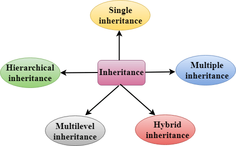
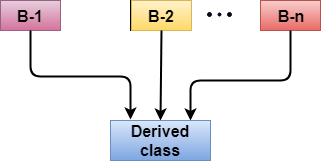
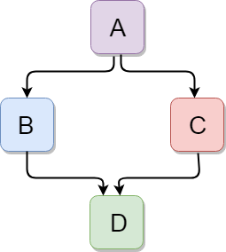

# C++ Class Inheritance

## `Inheritance` 

Inheritance: The capability of a "class" to derive properties and characteristcs from another class is called inheritance. 

Inheritance is a feature or a process in which new classes are created from 
the existing classes. The new class created is called "derived class" or 
"Child class" and the existing class is known as the "base class" or 
"parent class". The derived class now is said to be inherited from the base 
class.

`Explanation:` when we say derived class inherits the base class, it means the derived class inherits all the properties of the base class, without changing the properties of base class and may add new features to tis own.

These new features in the derived class will not affect the base class. The derived class is the extended version of the base class.

`Sub Class:` The class that inherits properties from another class is called _subclass_ or _derived class_.

`Super Class:` The class whose properties are inherited by a subclass is called _BaseClass_ or _SuperClass_.


#### What is the need of inheritance and where should we use it.

Suppose that we want to create classes for different kind of vehicle like, Bus, Car, Truck, Bike etc. For all of these classes ther are some methods which will be common to each classes like applyBreak(), headLightOn(), headLightOff(), start(), move() etc. 

In this kind of situation we have to redefine the same functionality for each class which will be a time consuming task, To avoid this kind of situation we use the inheritance concept in which we make a class which will 
have those common functionality for the _sub-class_ or _derived-class_.

By Defining a common class for each type of vehicle, who share the common functionality, they will inherit those functionality from that super class.

`Advantage of inheritance:` 
    
* Increase the reusability.
* easy to debug
* easy to add the new functionalities with some protections.
* structure is well managed.

**Implementing the inheritance in C++:** For creating a sub-class that is inherited from the base class we have to follow the below syntax.

```C++
    class <derived_class_name> : <access-specifier> <base_class_name>{
        // derived class body.
    }
```
Here: 

`class:` keyword to create a new class.
`derived_class_name:` name of the new class, which will inherit the base class.
`access-specifier:` either of private, public or protected. if neither is specified,  private is taken by default. 
`base_class_name:` name of the base class from which derived class will inherit the attribute and functions.

**`Note:`** A derived class doesn't inherit access to private data member. However, it does inherit a full parent object which contains any private members which that class declare.

```C++
// 1. Inheriting the base class as private.
class Derived: private Base{}; // private inheritance Declaration.

// 2. Inheriting the base class as public.
class Derived: public Base{}; // public inheritance declaration.

// 3. Inheriting the base class as protected
class Derived: protected Base{}; // protected inheritance declaration.

// 4. Inheriting the base class as default.
class Derived: Base{};  // by default private inheritance will be happen.
```

1. When a base class is privately inherited by the derived class, public members of the base class becomes the private members of the derived class. and therefore, the public members of the base class can only be accessed by the members functions of the derived class.They are inaccessible to the object of the derived class.


2. When the base class is publicly inherited by the derived class, public member of the the base class also becomes the public members of the derived class. Therefore, the public members of the base class are accessible by the object of the derived class as well as by the members functions of the derived class.


### `Modes of Inheritance`

1. `Public Mode:` if we derive a subclass from a public base class. then the public member of the base class will become public in the derived class and protected members of the base class will become protected in the derived class.


2. `Protected Mode:` If we derive a subclass from a Protected base class. Then both public members and protected members of the base class will become protected in the derived class.

3. `Private Mode:` If we derive a subclass from a Private base class. Then both public members and protected members of the base class will become Private in the derived class.

**`Note:`** The private members in the base class cannot be directly accessed in the derived class, while protected members can be directly accessed.

### `Types Of Inheritance`

1. Single inheritance
2. Multilevel inheritance
3. Multiple inheritance
4. Hierarchical inheritance
5. Hybrid inheritance



**`1. Single Inheritance:`** In Single Inheritance, a class is only inherit from only one class. or in other word only one subclass is inherited by one base class only.


Syntax: 

```C++
    class subclass_name: access_mode base_class{
        // boyd of subclass
    }
```

or in other word

```C++

class A{
    // body of the Base class.
}

class B: public A{
    // body of the subclass.
}

```
**`2. Multilevel Inheritance: `** In this type of inheritance, a derived class is created from another derived class. 


```C++

class A{
    // body of the Base class.
}

// class B inherit the class A
class B: public A{
    // body of the subclass.
}

// class C inherit the class B
class C: public B{
    // body of the subclass
    // Not for class C Base class is B.
}

```


**`3. Multiple Inheritance: `** Multiple Inheritance is a feature of C++ where a class can inherit from more than one class.



Syntax:
```C++
    class base_name : access_mode base_class1, access_mode base_class2{
        // body of class.
    } 

    class A{
        // body of class A
    }

    class B{
        // body of class B
    }

    // subclass which will inherit the both A and B.
    class C: public A, B{
        // body of the class C..
    }
```

**`4. Hierarchical Inheritance: `** In this type of inheritance more than one subclass is inherited from a single base class. in this more this one derived class is created from a single base class.


Syntax:
```C++
class A  
{  
    // body of the class A.  
}

class B : public A   
{   
    // B inherit the A
    // body of class B.  
}

class C : public A  
{  
    // C inherit the A
    // body of class C.  
} 

class D : public A  
{  
    // D inherit the A
    // body of class D.  
} 

class E : public B{
    // E inherit the B
    // body of class B 
}

class F : public B{
    // F inherit the B
    // body of class B
}
```

**`5. Hybrid (Virtual) Inheritance: `** Hybrid inheritance is implemented by combining more than on type of inheritance. in this we can combine two or more kind of inheritance like combining multiple inheritance, hierarchical inheritance, multilevel inheritance.



Syntax:
```C++
class A  
{  
    // body of the class A.  
}

class B : public A   
{   
    // B inherit the A
    // body of class B.  
}

class C : public A  
{  
    // C inherit the A
    // body of class C.  
} 

class D : public A  
{  
    // D inherit the A
    // body of class D.  
} 

class E : public B{
    // E inherit the B
    // body of class B 
}

class F : public B{

}

class G : public E, public F{
    // G inherit the E and F
    // body of class G
}
```