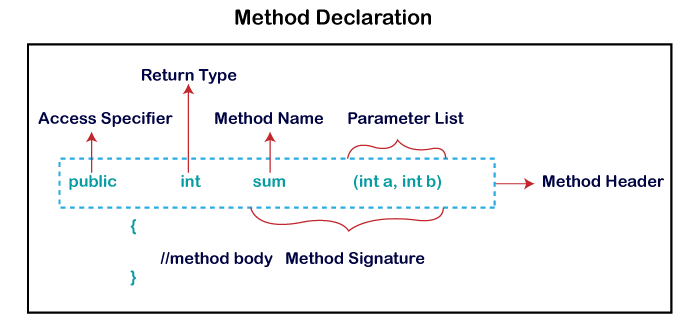

# Object and Classes in java

In this section we will learn about the java object and classes. In Object-Oriented Programming, we design a program using object and classes.

An Object in java is the physical as well as a logical entity, whereas, a class in java is a logical entity only.

### Object

An entity that has state and behavior is known as an object like pen, mobile, mouse, laptop etc. it can be physical or logical (tangible and intangible).

An Object has three characteristics:

* `State`: represents the data (value) of an object.

* `Behavior`: represents the behavior (functionality) of an object such as Make a Call, Play Music, etc.

* `Identity`: An object identity is typically implemented via a unique ID. The value of the ID is not visible to the external user. However, it is used internally by JVM to identify each object uniquely.

An object is an instance of a class. A class is a template or blueprint from which objects are created. So, an object is the instance (result) of a class.

Object Definition:

* An object is a real-world entity.
* An object is a runtime entity.
* The object is an entity which has state and behavior.
* The object is an instance of a class.

## Class in Java

A class is a group of object which have common properties. it is a template or blueprint from which objects are created. it is a logical entity. it can't be physical.

A class in java can contain.

* Fields 
* Methods
* Constructor
* Blocks
* Nested class and interface

### Instance variable in Java

A variable which is created inside the class but outside the method is known as instance variable. Instance variable doesn't get memory at compile time. it gets memory at runtime when an object or instance is created. That is why it si known as an instance variable.

we can initialize object and its variable by using three ways.

1. By reference variable
2. By method
3. By Constructor

### Method is java

A method is like a function which is used to expose the behavior of an object. Main advantage of the method is `Code Reusability` and `Code Optimization`.

### new keyword

The new keyword is used to allocate memory at runtime. All objects gets memory in Heap memory area.

### Different ways to create an Object

* By new keyword
* By newInstance() method
* By clone() method
* By deserialization
* By factory method etc.

### Anonymous object

Anonymous simply means nameless. An object which has no reference is known as an anonymous object. it can be used at the time of object creation only. if we have to use an object only once, an object is good approach.

 

# Method in Java

A method is a way to perform some task. method is a collection of instruction that performs a specific task. it provides the reusability of code. We can also easily modify code using methods. 

* A method is a block of code or collection of statement or set of code grouped together to perform a certain task or operation. 

* it is used to achieve the reusability of code. We write a method once and use it many times. 

* it provides the easy modification and readability of code.

* The method is executed only when we call or invoke it.

### Method Declaration

The method declaration provides information about method attributes, such as visibility, return-type, name, and arguments. 

