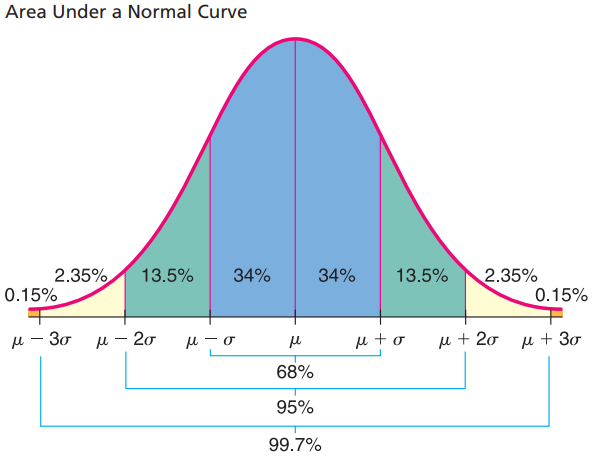
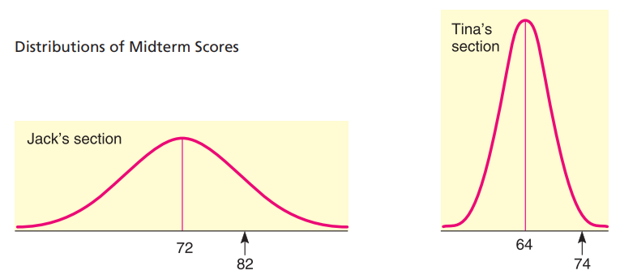
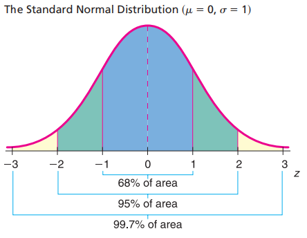
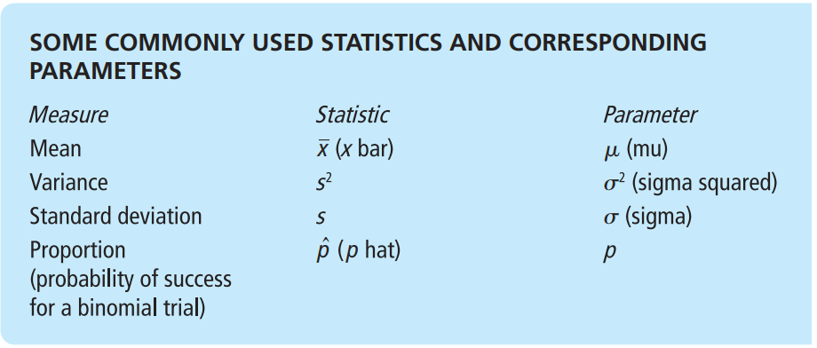

# Normal Probability Distributions

**Normal Curve:** The graph of normal distribution is called a normal curve. It possesses a shape very much like the cross section of a pile of dry sand. The normal curve is also called a bell-shaped curve.

A general normal curve is smooth and symmetric about the vertical line extending upward from the mean $\mu$. Notice that te highest point of the cure occurs over $\mu$. The normal curve never touches the horizontal axis. The parameter $\sigma$ controls the spread of the curve. The curve is quite close to the horizontal axis at $\mu + 3\sigma$ and $\mu - 3\sigma$.Thus, if the standard deviation $\mu$ is large, the curve will be more spread out: if it is small, the curve will be more peaked.

In above graph it shows the normal curve cupped downward for an ineval on either side of the mean $\mu$. Then it betins to cup upward as we go to the lower part of the bell. The exacet place where the transition b/w the upward and downward cupping occur are above the points $\mu + \sigma$ and $\mu - \sigma$. In terms of calculus, transition points such as these are called inflection points.

> ## Important Properties of a Normal Curve
>
> 1. The curve is bell-shaped, with the highest point over the mean $\mu$.
> 2. The curve is symmetric about the vertical line through $\mu$.
> 3. The curve approaches the horizontal axis but never touches or crosses it.
> 4. The inflection (transition) point b/w cupping upward and downward occur above $\mu + \sigma$ and $\mu - \sigma$.
> 5. The area under the entire curve is 1.

`Note:` The parameters that controls the shape of a normal curve are the mean $\mu$ and the standard deviation $\mu$. when both $\mu$ and $\sigma$, are specified, a specific normal curve is determined. In brief, $\mu$ locates the balance point and $\sigma$ determines the extent of the spread.

> `COMMENT` The normal distribution curve is always above th horizontal axis. the area beneath the curve and above the axis is exactly 1. such, the normal distribution curve is an example of density curve. The formula used to generate the shape of the normal distribution curve is called the **normal density function**. if $x$ is a normal random variable with mean $\mu$ and standard deviation $\sigma$, the romula for the normal density function is
>
> $$
> {\displaystyle f(x)={\frac {1}{\sigma {\sqrt {2\pi }}}}e^{-{\frac {1}{2}}\left({\frac {x-\mu }{\sigma }}\right)^{2}}}
> $$
>
> The graph of the normal distribution is important because the portion of the area under the curve above a given interval represents the probability that measurement will lie in that interval.

## Empirical Rule

For Normal distribution,

1. Approximately 68% of the data values will lie within 1 standard deviation on each side of the mean.
2. Approximately 95% of the data values will lie within 2 standard deviations on each side of the.
3. Approximately 99.7% of the data values will lie within 2 standard deviations on each side of the.

The above statementis called the _empirical rule_ because, for symmetric, bell-shaped distributions, the given percentages are observed in paractice.

# Standard Normal Distribution

**Standard Normal Distribution:** it is a way to compare and compute for all kind of normal distribution with different pair of values $(\mu, \sigma)$ because it will be very futile task to try to set up a table of areas under the normal curve for each different pair of $(\mu, \sigma)$ combination.

We achieve this standardization by considering how many standard deviations are measurement lies from the mean. In this way we can compare a value in one normal distribution with a value in another, different normal distribution.

> ### For example
>
> Suppose Tina and Jack are in two different sections of the same course. Each section is quite large, and the scores on the midterm exams of each section follow a normal distribution.
>
> In Tina's section the mean was 64 and her score was 74. In Jack's section the was 72 and his score was 82. Both Tina and Jack pleased that their scores were each 10 points above the average of each respective section.
>
> However, the fact that each was 10 points above average does no really tell us how each did with respect to the other students in the section.
>
> Tina's 74 was higher than most of th eother score in her section, while Jack's 82 is only an upper-middle score in his section. Tina's score is far better with respect to her class than Jack's score is with respect to his class.

The above example demostrates that it is not sufficient to know the differeence b/w a measurement and the mean of a distribution. we need also to consider the spread of the curve, or the standard deviation. What we really want to know is the number of standard deviation b/w a measurement and the mean.

**z-number:** The number z is the number of standard deviations b/w a measurement $x$ and the mean $\mu$ of a normal distribution with standard deviation $\sigma$:

#### Standard Score

The `z-value` or `z score` (also known as standard score) gives the number of standard deviations between the oritinal measurement x and the mean $\mu$ of the $x$ distribution.

$$
z = \frac{x-\mu}{\sigma}
$$

**Note:** The mean is a special value of a distribution. if $x$ becomes the $\mu$ (equal to the mean of the original distribution) then z score will become 0.

$$
z  = \frac{x-\mu}{\sigma} = \frac{\mu-
mu}{\sigma} = 0
$$

> ### Standard Score Interpretation
>
> A standard score or z score of a measurement tells us the number of standard deviations the measurement is from the mean.
>
> - A Standard score close to zero tells us the measurement is near the mean of the distribution.
> - A positive standard score tells us the measurement is above the mean.
> - A negative standard score tells us the measurement is below the mean.
>
> Given an $X$ distribution with mean $\mu$ and standard deviation $\sigma$, the **raw score** corresponding to a z score is $x = z\sigma + \mu$.

**`Standard Normal Distribution:`** The **Standard Normal Distribution** is a normal distribution with mean $\mu = 0$ and standard deviation $\sigma = 1$.

If the original distribution of **x values is normal**, then the corresponding z values have a normal distribution as well. The z distribution has a mean of 0 and a standard deviation of 1.

**Note:** Any normal distribution of x values can be converted to the standard normal distribution by converting all x values to their corresponding z values. The resulting standard distribution will always have mean $\mu = 0$ and standard deviation $\sigma = 1$.

> #### Standard Normal Distribution Interpretation
>
> When we have the standard normal distribution,
>
> - The standard deviation is 1.
> - the mean is 0.
> - any normal distribution can be converted to a standard normal distribution by converting all the measurement to standard z scores.

Note: The advantage of standard normal distribution is that we need to only calcuate the area under single cure, as in result we have extensive tables that shows the area under the standard normal curve for almost any interval along the $z$-axis. The

The areas are important because each area is equal to the probability that the measurement of an item selected at random falls in this interval.

- `Note:` Because the normal distribution is continuous, there is no area under the curve exactly over a specific $z$. therefore
- Probabilities such as $P(z \ge z_1)$ are the same as $P(z > z_1)$.

### Area Under any Normal Curve

To find area and probability for a random variable $x$ values to $z$ values using the formula

$$
z = \frac{x-\mu}{\sigma}
$$

after converting the normal curve to standard normal curve we can use the standard normal distribution table.

### Chekcing For Normaility

**How to determine whether data have a normal distribution**

1. `Histogram:` For a normal distribution, the histogram should be roughly bell-shaped.
2. `Outliers:` For a normal distribution, there should not be more than one outlier. check with _box-and-whisker_ plot.
3. `Skewness:` Normal distribution are symmetric. One measure of skewness for sample data is given by Pearson's index:

   $$
   \text{Person's index} = \frac{3(\bar{x} - median)}{s}
   $$

   An index value greater than 1 or less than -1 indicates skewness. Skewed distributions are not normal.

4. `Normal Quantile plot (or normal probability plot):` A normal quantile plot is a graphical method for comparing two probability distributions by plotting their quantiles against each other.

---

# Sampling Distribution

**Population:** A population can be thourght of as a complete set of measurements (or counts), either existing or conceptual. The Descriptive measure of a population is called _parameter._

**Sample:** A sample is a subset of measurements from population. for our purpose, the most important samples are random samples. The Descriptive measure of sample is called _statistic_.

Note: Ofen we do not have access to all the measurements of an entire population because of constraints on time, money, or effort. So, we must use measurements from a sample instead.

In such cases, we will use a statstic to make _inferences_ about a corresponding _population parameter_.

> ### Types of Inheritance
>
> 1. **`Estimation: `**In this type inference, we estimate the value of a population parameter.
> 2. **`Testing:`** In this type of inference, we formulate a decision about the value of a population parameter.
> 3. **`Regression:`** In this type of inference, we make predictions or forecasts about.

**`Sampling Distribution:`** To evaluate the reliability of our inferences, we will need to know the probability destribution for the statistic we are using. Such a probability distribution is called a sampling distribution.

A Sampling distribution is a porbability distribution of a sample statistic based on all posible simple random samples of the same size from the same population.

> ### Sampling Distribution Tells
>
> A sampling distribution gives us information regarding sample statistics such as $\bar{x}$.
>
> - The sampling distribution is based on values of the sample statistics from all samples of a specified size n.
> - Sampling distributions are used to obtain information about correspoinding population parameters like $\mu$ (population mean).

## The Central Limit Theorem

The central limit theorem is a concept in statistics that says that the average of a large number of samples from a population will be close to the average of the population itself, even if the population is not normally distributed. This means that if you take many random samples from any population and calculate their means, the distribution of those means will look like a bell-shaped curve, which is called a normal distribution.

For example, suppose you want to know the average height of all the students in your school. You can't measure every student, so you take some random samples of students and measure their heights. Then you calculate the mean height for each sample. If you plot the sample means on a graph, you will see that they form a normal distribution around the true population mean. The more samples you take, the more accurate your estimate will be.

The central limit theorem has a formula that tells you how to find the mean and the standard deviation of the sampling distribution of the mean. The formula is:

$$
\overline{X} \sim N(\mu, \frac{\sigma}{\sqrt{n}})
$$

Where:

- $\overline{X}$ is the sampling distribution of the sample means
- $N$ means "follows the normal distribution"
- $\mu$ is the mean of the population
- $\sigma$ is the standard deviation of the population
- $n$ is the sample size

The central limit theorem is useful for many applications in statistics, such as confidence intervals, hypothesis testing, and quality control. It allows us to use normal distribution methods even when the population is not normal.

### 1. For a Normal Probability Distribution:

`Theorem:` Let $x$ be a random variable with a normal distribution whose mean is $\mu$ and whose standard deviation is $\sigma$.

Let $\bar{x}$ be the sample mean corresponding to random sample of size n taken from the x distribution.

`Then:`

1. The $\bar{x}$ is distribution is normal distribution.
2. The mean of the $\bar{x}$ distribution is $\mu$.
3. The standard deviation of the $\bar{x}$ distribution is $\frac{\sigma}{\sqrt{n}}$.

From above theorem, when x has a normal distribution, the $\bar{x}$ distribution will be normal for any sample size n. Furthermore, we can convert the $\bar{x}$ distribution to the standard normal z distribution using the following formula.

$$
z = \frac{\bar{x} - \mu}{\sigma_{\bar{x}}}
= \frac{\bar{x} - \mu}{\frac{\sigma}{\sqrt{n}}}
$$

Where n is the sample size $\mu$ is the mean of the x distribution, $\sigma$ is the standard deviation of the x distribution.

`Note:` Above theorem describes the distribution of a particular statistic, namely, the distribution of sample mean $\bar{x}$. The standard deviation of a statistic is referred to as the **standard error** of that statistic.

> **In other words:**
>
> The **standard error** is the standard deviation of a sampling distribution.
>
> For $\bar{x}$ sampling distribution,
>
> $$
> \text{standard error} = \sigma_{\bar{x}} = \frac{\sigma}{\sqrt{n}}
> $$

### For Any Probability Distribution

if x possesses any distribution with mean $\mu$ and standard deviation $\sigma$, then the sample mean $\bar{x}$ based on a random sample of size n will have a distribution that approaches the distribution of a normal random variable with mean $\mu$ and standard deviation $\frac{\sigma}{\sqrt{n}}$ as n increases without limit.

The central limit theorem says that x can have any distribution whatsoever, but that as the sample size gets larger and larger, the distribution of $\bar{x}$ will approach a normal distribution.

`Note:` In Practice, it is a good idea, when possible, to make a histogram of sample x values. if the histogram is approximately mound-shaped, and if it is more or less symmetric, then we may be assured that, for all practical purpose, the $\bar{x}$ distribution will be well approximated by a normal distribution and the central limit theorem will apply when the sample size is 30 or larger.

> ### What Does the central limit theorem tells us.
>
> The central limit theorem gives us information about the characteristics of the $\bar{x}$ sampling distribution based on all samples of size $n$. When $n$ is sufficiently large $n \ge 30 \text{in most cases}$, the central limit theorem tells us that.
>
> - the $\bar{x}$ distribution is approximately normal.
> - the mean of the $\bar{x}$ distribution is $\mu$, the mean of the original x distribution.
> - the satandard deviation (also know as the standard error) of the $\bar{x}$ distribution is $\frac{\sigma}{\sqrt{n}}$, where $\sigma$ is the standard deviation of the x distribution.

### Bias and Variability

> Wherever we use a sample statistic as an estimate of population parameter, we need to consider boh bias and variability of the static.
>
> A sample statistic is unbiased if the main of its sampling distribution equals the value of the parameter being estimated.
>
> The spread of the sampling distribution indicates the variability of the statistic. the spread is affected by the sampling method and the sampling method and the sample size. Statistics from a larger random sample have spreads that are smaller.
>
> we see from central limit theorem that the sample mean $\bar{x}$ is an unbiased estimator of the mean $\mu$ when $n \ge 30$. The variability of $\bar{x}$ decreases as the sample size increases.
